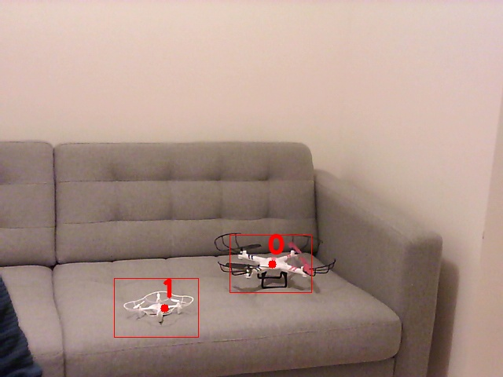
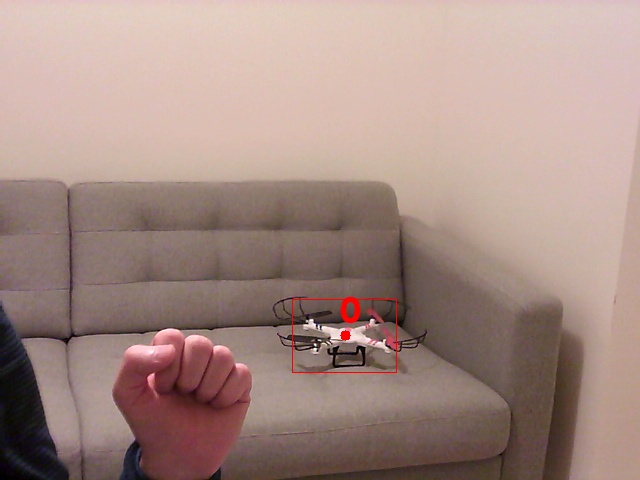
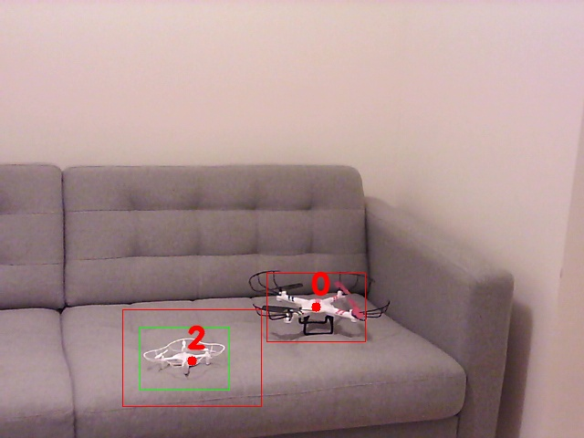

# Centroid Tracker

Depending on the Computer Vision tasks to be solved, identification on multiple frames of the same object could be a challenging problem. There is a set of state of the art object trackers available in OpenCV that can be used out of the box [1], I have chosen to implement a simple one for testing purposes.

<p align="center"> 
  </a>
  </a>
  </a>
</p>

Picture 1, shows a situation where 2 objects of the same type are detected, each of them gets a unique ID. In the next picture, one of the objects is occluded, therefore a single ID is present. In the last picture when the "new" object reappears a new ID is assigned. Depending on the number of frames where the object is missing the ID number remains or is reset. Please take a look at the input parameters for the Centroid Tracker to tweak this behavior.

### How does it works?

The processing chain follows the next pattern:
- All objects of the same type are detected on a single frame, using a Cascade Classifier, more info here[2].
- Non-Maximum-Suppression s applied to reduce the duplicates, more info here [3].
- The Centroid Tracker is called, the euclidian distance for reach detection is calculated. Neighbors inside in a threshold are clustered (with the same unique ID), for each cluster an element is copied to the return list.

### How to use

```
usage: test_centroid_tracker.py [-h] [-cam CAM] [-n N] [-s S] [-iou IOU]
                                [-sd SD] [-rid RID]

Centroid Tracker tester. Defaults: -cam 0 -n 0 -s 1.1 -iou 0.1 -sd 40.0

optional arguments:
  -h, --help  show this help message and exit
  -cam CAM    Camera ID
  -n N        Number of neighbors for detections
  -s S        Scale factor
  -iou IOU    Intersection Over Union threshold
  -sd SD      Maximum allowed separation euclidian distance between neighbors
  -rid RID    Optimize IDs, IDs are equal to the number of objects detected. Defaults to False

```
Please take a look at the last 2 parameters, the important ones for the tacker. Separation distance mainly depends on the detection noise, light conditions, and resolution used.
Reusing the IDs follows the path of assigning ID based on the number of detections on a single frame (ex. if the scenario above with occlusion is used, using "rid" after the second object reappears on the scene, the ID will be 1, since we have 2 objects ID=0 and ID=1).


### TODO
 - Optimize ID assignment after the buffer is empty
 - optimize code with i.e. Kalman filter prediction => reduce the number of object detection needed over frames. Currently, object detection is needed on any frame, which requires significant processing power.

Any contribution is welcomed!


# Resources

1. [Multiple Object Tracking in Realtime](https://opencv.org/multiple-object-tracking-in-realtime/)
2. [Cascade_tools](https://github.com/fvilmos/cascade_tools)
3. [Non-Maximum-Suppression - cascade](https://github.com/fvilmos/cascade_nms)

/Enjoy.
